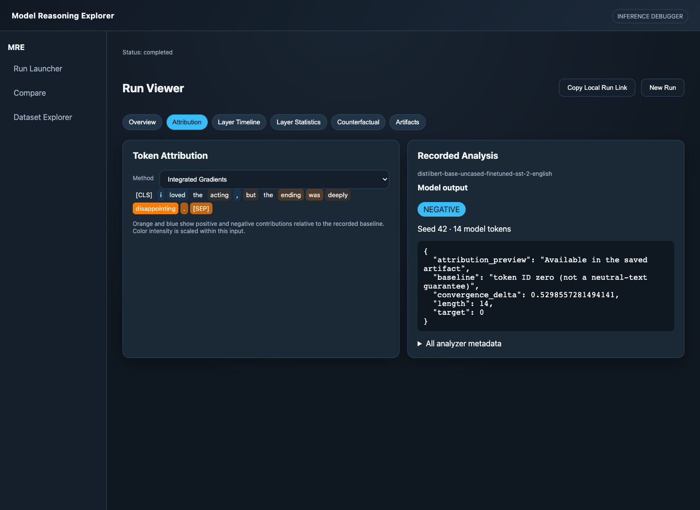

# Model Reasoning Explorer

A local developer tool for inspecting and comparing machine-learning inference behavior.



## What it supports

- Text inference with tiny GPT-2 and a DistilBERT sentiment classifier; image classification with ResNet-18.
- Saved outputs, layer statistics, attention summaries, integrated gradients, and image Grad-CAM.
- Comparisons between saved runs, with explicit limits when inputs or model tensors do not align.
- Edited-input reruns and a small text-classifier counterfactual search.
- CSV dataset inspection with confusion matrices, confidence bins, error slices, and embedding clusters.
- Portable JSON/NumPy artifacts and static HTML reports.

## How it works

The React/TypeScript UI submits requests to FastAPI. A run manager loads an allowlisted model through a task-specific adapter, captures tensors with hooks, runs analyzers, and writes artifacts under `backend/runs/`. WebSocket updates and status polling drive the viewer. The CLI uses the same execution path. See the [architecture overview](docs/ARCHITECTURE.md).

Models and inputs stay on the local machine after model downloads. No hosted inference API or API key is required. Run and report files may contain your original inputs; keep them private.

## Quick start

Requires **Python 3.11–3.13** and **Node.js 22.13+ in the 22.x series, or Node.js 24.x**. CPU execution is the default. The first model run downloads public weights from Hugging Face or Torchvision; download time and memory use depend on the selected model.

```bash
git clone https://github.com/ShauryaMallampati/Model-Reasoning-Explorer.git
cd Model-Reasoning-Explorer
python3 -m venv .venv
source .venv/bin/activate
python -m pip install -e 'backend[dev]'
(cd frontend && npm ci)
make dev
```

Open `http://127.0.0.1:5173`. The backend listens on `127.0.0.1:8000`. Keep the virtual environment active when using the scripts or CLI. On Windows, use `.venv\Scripts\Activate.ps1` and run the servers in separate terminals:

```bash
mre serve
# In a second activated terminal:
cd frontend
npm run dev -- --host 127.0.0.1
```

Choose a task and model in **Run Launcher**, submit an input, then open **Run Viewer**. For the text classifier, try `I loved the acting, but the ending was deeply disappointing.` The Attribution tab displays signed token contributions and the recorded method settings. Image runs require gradient capture for Grad-CAM; the UI enables it when selecting image classification.

## Small demos

From the repository root with the virtual environment active:

```bash
bash scripts/demo_text.sh
bash scripts/demo_vision.sh
mre export --run-id YOUR_PRINTED_RUN_ID
```

The text demo uses tiny GPT-2, a small test model whose generated text is not meaningful evidence of language-model quality. The vision demo uses the bundled 16×16 synthetic image to verify execution and artifact generation, not classification accuracy. The screenshot above is from an actual DistilBERT run, not a mockup.

**Dataset Explorer** can run `text/sample_text.csv`, a six-example sentiment fixture. Its scores are descriptive checks of those examples, not a held-out model evaluation. Each example links to its saved run. To compare runs, enter their IDs on **Compare**; unsupported tensor alignment is reported rather than fabricated.

Configuration is in `backend/mre_config.toml`. `MRE_CONFIG` selects another configuration file. `MRE_ALLOW_GPU=1` opts into an available accelerator. `python scripts/download_models.py` downloads all three demo models to the standard model caches.

## Verification

```bash
python -m pytest backend/tests
python -m ruff check backend
python -m black --check backend
python -m build backend
(cd frontend && npm run lint && npm run typecheck && npm test && npm run build)
```

Tests cover request/path boundaries, artifact safety, analyzer behavior, run comparisons, dataset validation, polling, and UI error states. Unit tests use small fixtures and do not require downloading pretrained weights. The CLI and browser demos exercise actual pretrained models separately.

## Limitations and safety

MRE is a **local, single-user tool**, not an authenticated public service. Do not expose its ports to untrusted networks or load untrusted checkpoints. Keep uploads and model paths inside the configured safe directories.

Attributions describe a chosen model, target, and baseline; they are not causal explanations or a guarantee that a prediction is correct. Attention is not automatically an explanation. Layer output-head projections are architecture-dependent diagnostics. Cross-input tensor comparisons require compatible alignment. Dataset jobs are bounded and their in-memory status is not a durable job queue. Cancellation cannot interrupt an already executing model operation immediately.

Community contributions should include a focused regression test and pass the verification commands above. Please do not post private inputs, credentials, or model artifacts in issues.

## License

[MIT](LICENSE). Third-party model weights and datasets retain their own licenses.
