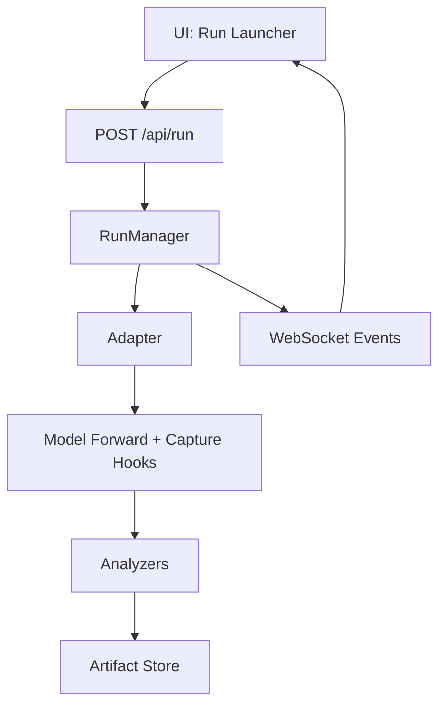

# Architecture

MRE is a monorepo with a Python FastAPI backend and a React + Vite frontend. The backend runs model inference, capture hooks, analyzers, and artifact storage. The frontend provides DevTools-style views for single runs, comparisons, and dataset slices.

## High-Level Flow

## Backend Modules
- `adapters/`: task-specific model integration
- `capture/`: hook registration and signal capture
- `analyzers/`: explanation and diagnostic methods
- `core/`: run manager, artifact store, WebSocket manager
- `api/`: REST and WebSocket endpoints

## Frontend Modules
- `pages/`: top-level views (Home, Run Viewer, Compare, Dataset)
- `components/`: reusable panels and widgets
- `state/`: global state (Zustand)
- `api/`: fetch wrappers and WebSocket handling

## Artifacts
Each run creates a folder containing:
- `metadata.json`
- `outputs.json`
- `summaries.json`
- `arrays_*.npz`
- `logs.txt`

Static HTML reports are generated under `backend/reports/<run_id>/`.
